# Boolzapp

In this project I am replicating the layout and some of the functionality of the WhatsApp webapp.  
The project will be completed over the span of five separate milestones, and all five will be preserved in the repo separately in order to show my work at various stages of the project.

## Features

- Layout with dynamically populated contact list and message lists from data arrays.

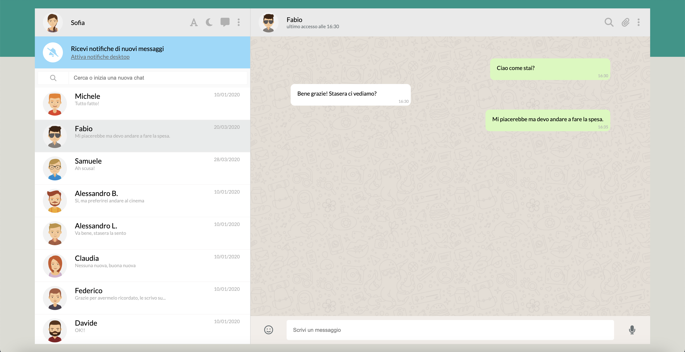

- Click on a contact opens their chat history.

- Possibility to add a new message to the conversation by typing it in the appropriate input field and pressing "Enter".

- Automatic reply one second after adding a message, taken randomly from a predetermined array.

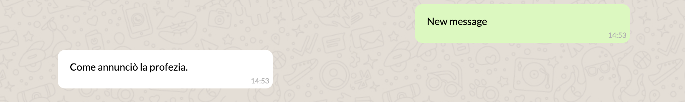

- Dynamic contact search function. Typing any string in the appropriate input field will only display the contacts whose names contain that string.

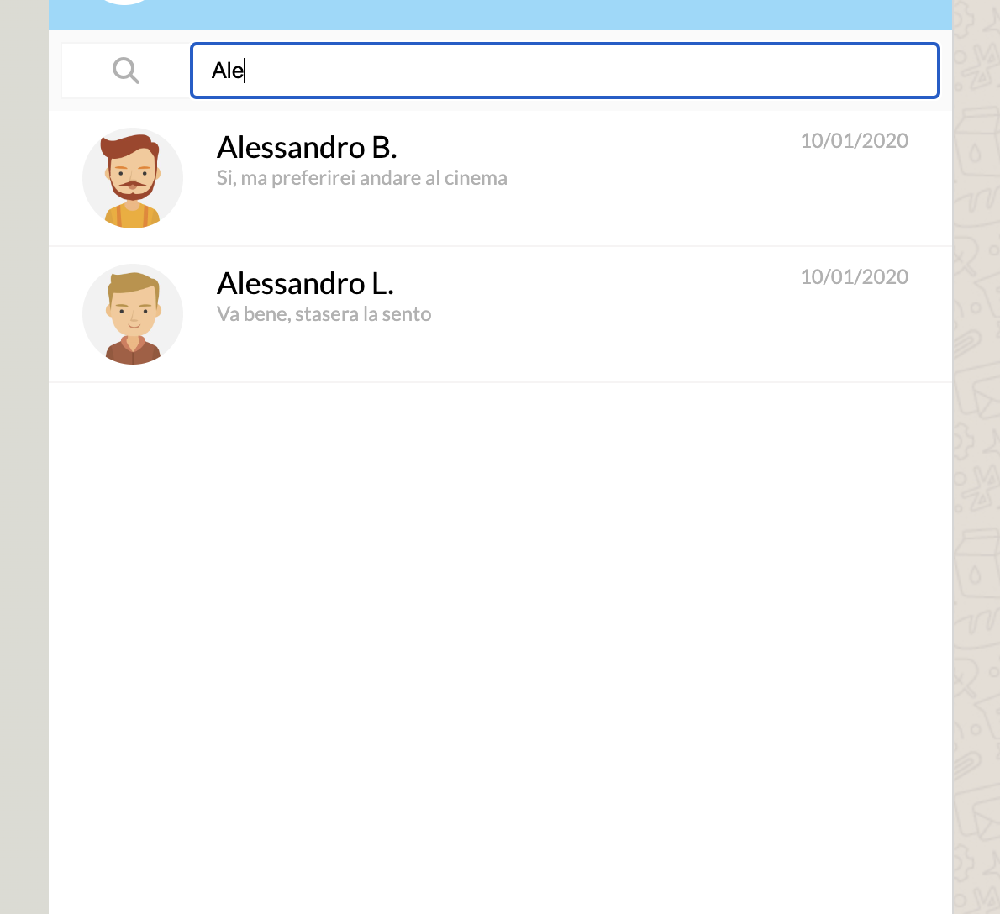

- Clicking on the down-arrow that appears when hovering over the upper right corner of a message opens a dropdown menu. Clicking on "Delete message" in that menu will delete the message.

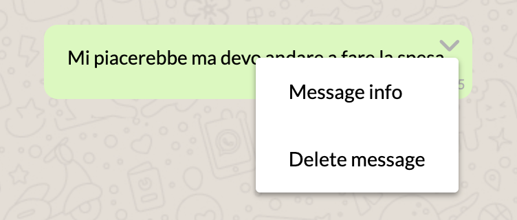

- Each entry in the contact list will display the text and time of the last sent or received message. Messages longer than 46 characters will be truncated. Messages sent or received on the same day will display the time, older messages will display the date.

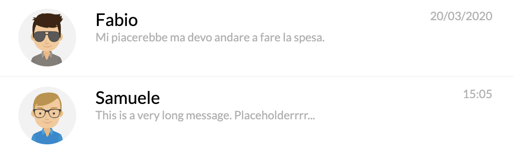

- Empty messages or messages composed entirely of spaces cannot be sent.

- While typing a message, the microphone icon in the lower right will be replaced with a paper airplane "send" button. Clicking on the button will send the message.

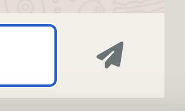

- Each new message displays the correct time it was sent or received.

- After sending a message, the status of the active user displayed above will change to "sta scrivendo..." ("typing...") until the response arrives. Then it will change to "online" for 2 seconds, and finally it will display the time of the last messages received from that contact.

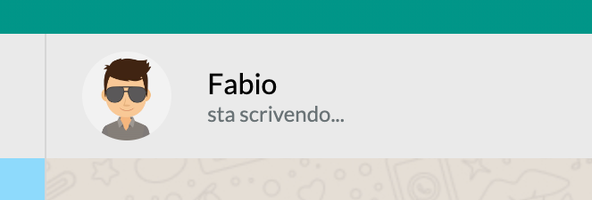

- By clicking on the vertical ellipsis icon on the upper right and selecting the appropriate option, it is now possible to delete all messages with the active user or the contact itself.

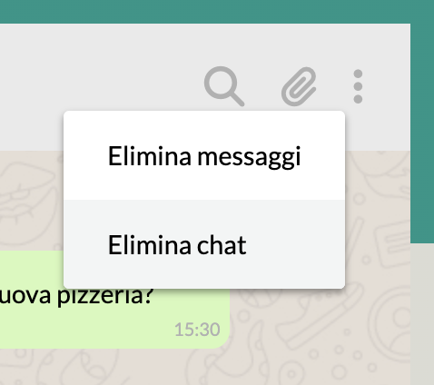

- Clicking on the chat bubble icon in the left header it is possible to add a new contact after specifying a name and an image path.

- Adding a new message automatically scrolls to the bottom of the conversation. This will not happen for received messages.

- A welcome screen will be displayed on on page load or after eliminating a contact.

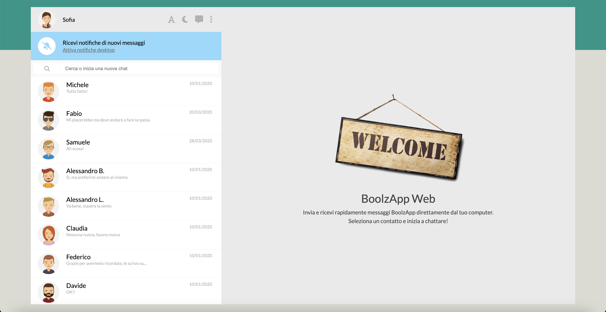

- A splascheern will be displayed for 1 second on page load.

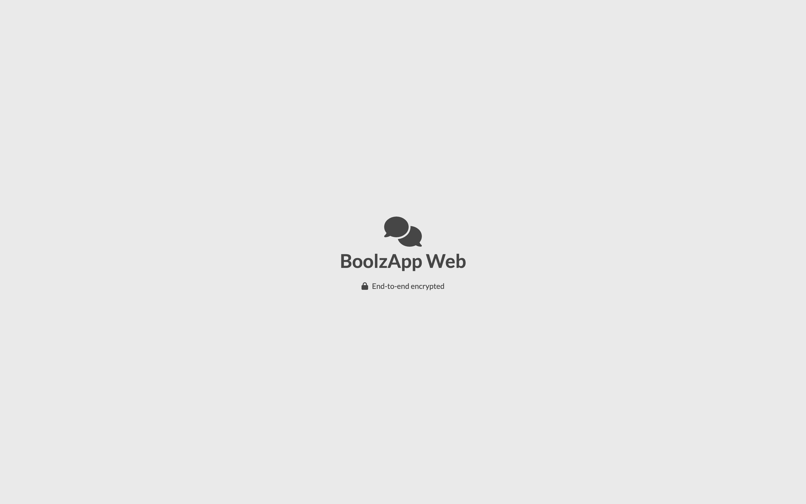

- Clicking on the "A" icon in the left header it is possible to toggle a bigger font size.

- Clicking on the moon icon in the left header it is possible to toggle dark mode.

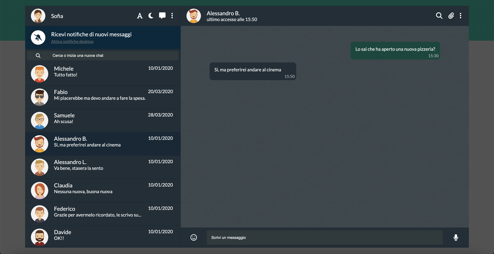

- The webapp is responsive. It will display in mobile mode on narrow screen sizes. Clicking on a contact will open their conversation.

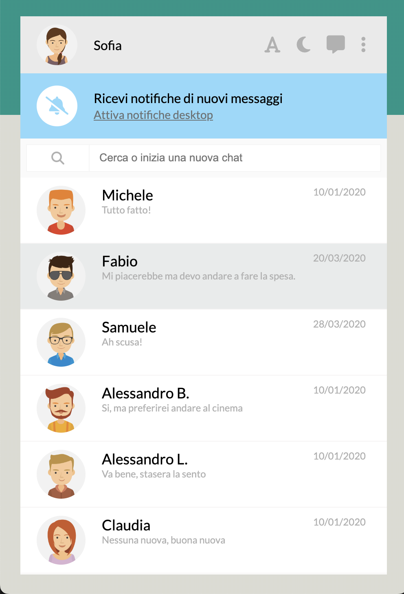

- While viewing a conversation in mobile mode a "back" button will appear that will bring the user back to the contact list.

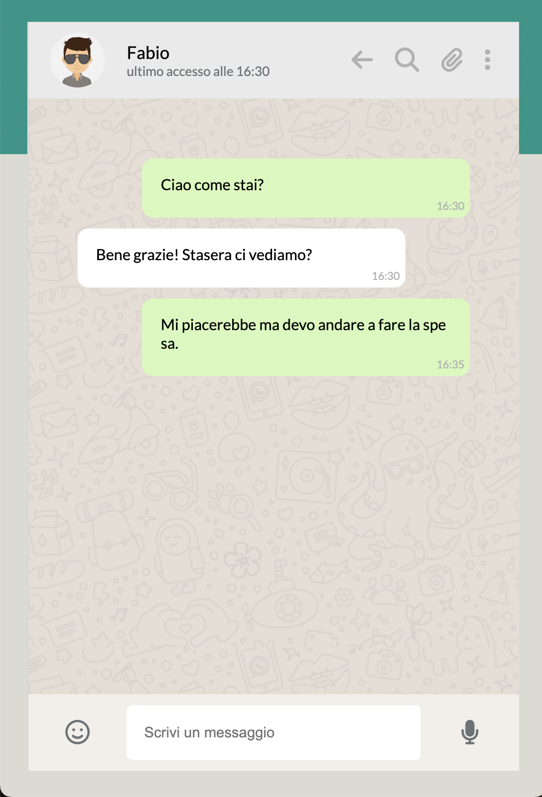

## Workflow

### Milestone 1

In this milestone I recreate the graphical interface of the webapp and populate the list of contacts dynamically with Vue.js.

JS:
1. Use v-for to populate the contact list with the relevant data. Use v-bind to access specific properties.

### Milestone 2

In this milestone I introduce dymanic visualization of messages for each contact on click.

1. Use v-for to populate the chat with the messages of the active contact.  
2. Add Luxon, create a method that reformats message times to show just the hours and minutes, use it to display the times in the message bubbles.  
3. Create a method that changes the contactIndex to match its argument. Use v-on to invoke the method when clicking on a contact in the contact list. This changes the active contact and displays their message history in the chat window.

### Milestone 3

In this milestone I add the possibility to write new messages and have them appear in the chat window after pressing Enter. Each message sent will be followed by an "ok" reply one second later.

1. Add a newMsg property and use v-model to attach it to the new message input field.
2. Create sendMsg method that pushes the value of the input field into the messages array of the active contact along with the current time.
3. Trigger the method when pressing Enter using v-on.
4. Create autoResponse method which sends back an "ok" reply.
5. Invoke autoResponse at the end of sendMsg after one second using setTimeout().

### Milestone 4

In this milestone I add a contact search feature that dynamically filters the contact list based on the string currently present in the searchbar.

1. Create a contactSearch property that tracks the content of the contact search bar with v-model.
2. Use a watcher to dynamically toggle the visible property of users whose names don't include the current search string.

### Milestone 5

In this milestone I add a "delete message" feature. I also visualize the time and text of the last sent or received message for each contact in the contact list.

Part 1:

1. Create a button in the corner of each message bubble that will trigger the appearance of the dropdown menu. The button will only be visible when hovered.  
2. Create the dropdown menu in html and css.
3. Create a dropdownsShown property that will keep track of which dropdown should be open based on a set of coordinates.
4. Create a toggleDropdown method that will close the dropdown if it's open. If it's not, it will open only that dropdown (closing any other open dropdowns if present).
5. Invoke the method on click of the angle symbol with v-on.
6. Create deleteMessage method that uses splice to remove a message from its array.
7. Use v-on to trigger the function when clicking the "Delete message" button, passing it the appropriate arguments.

Part 2:

1. Create getLastMessageTime method that returns nothing if no messages are present for a given contact, the time of the last message if was sent today, and the date of the last message if it was sent before today. Use Luxon to manage dates and times.
2. Create cropMessage method that crops longer messages in order to display them in smaller spaces.
3. Display text and time of the last message for each contact in the contact list.

### Bonus features

#### Add send message button

While typing a message, the microphone becomes a "send" button that can be clicked to send the message.

1. Use v-if and v-else to display the correct icon.  
2. Apply v-on to send the message on click.

#### Add random responses array

After sending a message you will now get back a random response from a predetermined array.

1. Create array of responses.  
2. Use this.randomResponses[Math.floor(Math.random() * this.randomResponses.length)] to select a random response from the array as the text of the received message.

#### Add active contact status

The status of the active contact will now be displayed. "Last seen" by default, then "Writing..." right before their response arrives, then "online" for 2 seconds, then back to "last online" showing the time they sent the last message.

1. Create a getLastReceivedMessageTime function that gets the time (HH:mm format) of the last message we received from the active contact, ignoring messages sent by us. Here we reuse the displayTime function we defined earlier.
2. Create empty userStatus property.
3. Create updateUserStatus to display the time of the last message received from the active contact. Handle the case of no received messages.
4. Modify changeChat to run updateUserStatus at the end.
5. Run updateUserStatus in mounted.
6. Display the userStatus in the chat window header.
7. Update sendMsg to set userStatus to "sta scrivendo..." immediately, then to trigger updateUserStatus after 3 seconds.
8. Update autoResponse to set userStatus to "online" one second after sending a message. This will create the "time of last message" -> "sta scrivendo..." -> "online" -> "time of new last message" cycle that we want.

#### Add "delete all messages" & "delete chat" buttons

The ellipsis on the upper right will now open a dropdown allowing you to delete all messages with the active contact or the entire conversation with that contact.

1. Create dropdown displayed and hidden with a v-on.
2. Create deleteAllMsgs function that empties the messages array of the active contact. Attach it to the appropriate button with a v-on.
3. Create deleteChat function that deletes the contact from the contacts array and sets contactIndex to 0. Attach it to the appropriate button with a v-on.

#### Add "New Chat" functionality

By clicking on the "plus" button above the contact list it is now possible to add a new conversation to the list after entering the new contact's name and profile pic.

1. Add plus icon.
2. Create addNewChat function that prompts the user to enter a name and an image url and unshifts (pushes to the start) the resulting contact into the contacts arrary if the name is not empty or composed only of spaces.

#### Scroll to bottom of chat window after sending a new message

The sendMsg function has been modified to scroll down to the bottom of the chat window after sending a new message. This doesn't happen when receiving messages, to prevent the user from being interrupted while reading older conversations.

1. Create scrollToBottom function that scrolls to the bottom of the chatwindow div (selected by its ref) when called.
2. Call the function at the end of sendMsg. Use this.$nextTick() to ensure proper timing.

#### Close dropdowns on click outside

The dropdown menus will now close when clicking anywhere outside of them.

1. Using a function, select the dropdown menu (using ref for the static dropdown and a query selector all for the dynamically generated ones). Check whether the dropdown is open.
2. Check whether the click was inside the area of the dropdown.
3. If the click was outside, modify the property that closes the dropdown.
4. Add an event listener for this function to the document in mounted.
5. Remove the event listeners before unmount.

#### Display welcome message

Instead of displaying the first contact by default, a welcome page will now be displayed on page load.

1. Change contactIndex default value to "null".
2. Add welcome page that only displays if contactIndex === null. Display the main in all other cases.
3. Remove call of updateUserStatus from mounted.

#### Display splash page

A splash page will now be displayed for one second on page load.

1. Create splash page that covers the entirety of the viewport.
2. Use v-if to hide hide it based on the value a boolean property.
3. Add a setTimeout to mounted that changes the value of the boolean to false after one second, hiding the splash page.

#### Add font size & dark mode toggles

It is now be possible to toggle font size and dark mode by clicking the relevant buttons.

1. Add booleans tracking the current state.
2. Add classes "dark" and "big-font" classes to the wrapper div based on the value of these booleans.
3. Modify css to overwrite the default values of colors and font sizes if those classes are present.

#### Make it responsive

The webapp is now responsive. By default it will only show the sidebar on mobile, with the possibility to open a conversation (hiding the contact list) by clicking on a contact and then go back to the contact list by clicking on the appropriate button.

1. Use css media query to hide the welcome page/chat window on mobile and grow the sidebar.
2. Create mobileShowChat boolean property that tracks whether the chat is shown on mobile (true) or the contact list is (false).
3. Use v-bind to hide the contact list and show the chat on mobile when the boolean is set to "false".
4. Modify changeChat function to set mobileShowChat to "true" at the end.
5. Create button only displayed on mobile that sets mobileShowChat to "false".
6. Modify deleteChat() function to set mobileShowChat to "false", so that deleting a chat on mobile sends you back to the contact list.
